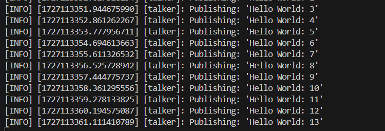

## Nota:
Todo este proceso que se detallará a continuacación esta grabado en este [video](https://unipe-my.sharepoint.com/shared?id=%2Fpersonal%2Fsaul%5Fnacion%5Fd%5Funi%5Fpe%2FDocuments%2FProyecto%20Cuadr%C3%BApedo%2FInstalacion%20Ubuntu%20y%20ROS&listurl=%2Fpersonal%2Fsaul%5Fnacion%5Fd%5Funi%5Fpe%2FDocuments). 

1. ## Instalacion de ROS
    La versión de ROS que usaremos será Humble y gazebo classic, para esto necesitamos tener   instalado la versión 22.04 de Ubuntu que se llama Jammy.

      

    Instalar ubuntu se puede hacer de varias maneras, la más sencilla es atravez de [wsl2](https://learn.microsoft.com/es-es/windows/wsl/install), las otras son dual boot y a travez de una máquina virtual.
    1. wsl (instalación fácil, recomendado)
    2. dual boot (instalación tediosa, recomendado)
    3. máquina virtual (no recomendado)

2. ### Instalar wsl en windows 
    Para esto se puede seguir la guía oficial de windows [link](https://learn.microsoft.com/es-es/windows/wsl/) o sino siga estos pasos:
    1. #### Abrir un terminal de windows PowerShell o Windows Command en modo administrador.

        #### Image
           

    2. #### Ejecutar

        ```bash
        wsl --install -d Ubuntu-22.04
        ```
        #### Output (en el caso de ustedes se procedera con la instalación)
           

    3. #### Descargar visual estudio code

        ```bash
        wsl --install -d Ubuntu-22.04
        ```

3. ### Instalar Ubuntu en dual boot
    Para instalar rn dual boot se encuentran varios videos de youtube, [video](https://www.youtube.com/watch?v=FId4-IO-yj4) 

4. ### Instalar ROS2 Humble
    Para instalar Ros2 Humble solo seguir el siguiente [documento](https://docs.ros.org/en/humble/Installation/Ubuntu-Install-Debs.html) o en tal caso ejecutar las siguientes lineas de codigo en el terminal. 

    1. #### Configuración regional o local

        ```bash
        locale  # check for UTF-8

        sudo apt update && sudo apt install locales
        sudo locale-gen en_US en_US.UTF-8
        sudo update-locale LC_ALL=en_US.UTF-8 LANG=en_US.UTF-8
        export LANG=en_US.UTF-8

        locale  # verify settings
        ```
    2. #### Setup resources

        ```bash
        sudo apt install software-properties-common
        sudo add-apt-repository universe

        sudo apt update && sudo apt install curl -y
        sudo curl -sSL https://raw.githubusercontent.com/ros/rosdistro/master/ros.key -o /usr/share/keyrings/ros-archive-keyring.gpg

        echo "deb [arch=$(dpkg --print-architecture) signed-by=/usr/share/keyrings/ros-archive-keyring.gpg] http://packages.ros.org/ros2/ubuntu $(. /etc/os-release && echo $UBUNTU_CODENAME) main" | sudo tee /etc/apt/sources.list.d/ros2.list > /dev/null

        ```
    3. #### Install ros2

        ```bash
        sudo apt update
        sudo apt upgrade
        sudo apt install ros-humble-desktop
        ```
    4. #### Configuración de entorno 

        Cada vez que se abre una nueva terminal, es necesario configurarla utilizando el siguiente comando:
        ```bash
        source /opt/ros/humble/setup.bash
        ```
        Si no desea realizar esta acción manualmente cada vez, puede agregar esta línea al archivo .bashrc, el cual se ejecuta automáticamente cada vez que se abre una nueva terminal. Para hacerlo, utilice el siguiente comando:
        ```bash
        echo "source /opt/ros/humble/setup.bash" >> ~/.bashrc
        ```
        Después de modificar el archivo .bashrc, es necesario reiniciar la terminal actual para que los cambios surtan efecto. Esto solo es necesario si continúa trabajando en la misma terminal, ya que el archivo .bashrc se ejecuta automáticamente al abrir una nueva terminal. Para aplicar los cambios en la terminal actual, ejecute:
        ```bash
        source ~/.bashrc
        ```
    5. #### Probar un ejemplo básico

        Abrir un terminal y ejecutar 
        ### Terminal 1
        ```bash
        source /opt/ros/humble/setup.bash 
        ros2 run demo_nodes_cpp talker
        ```
        ### Terminal 2
        ```bash
        source /opt/ros/humble/setup.bash
        ros2 run demo_nodes_py listener
        ```
        Ejecutar source * */opt/ros/humble/setup.bash* * solo es necesario si no se agrego la línea source * */opt/ros/humble/setup.bash* * al archivo * *.bashrc.* *

        ### Output
        #### Output terminal 1
          

        #### Output terminal 2
        

