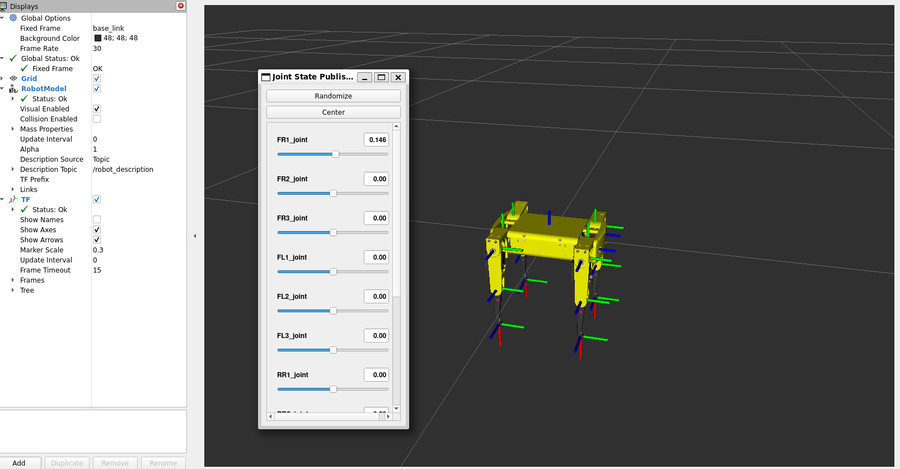

## Quadruped descripion


1. ###  Configuración de entorno
```bash
source ~/quadruped_robot_ws/install/setup.bash
```
2. ### Lanzamiento 
```bash
ros2 launch quadruped_description rviz_fake_joints.launch.xml
```
- #### Output 
    
      

