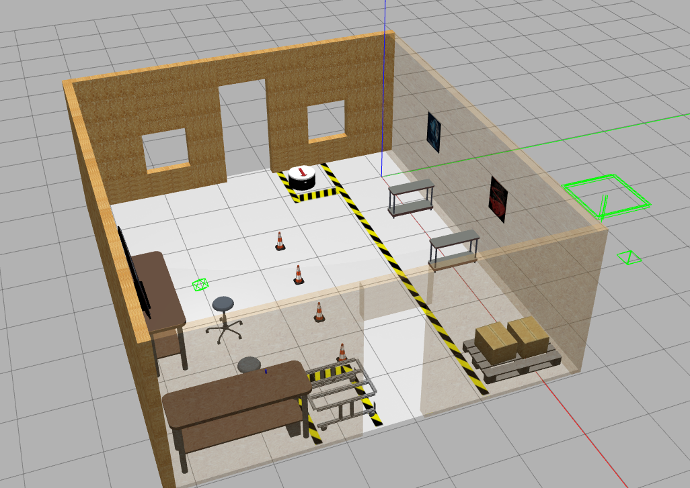
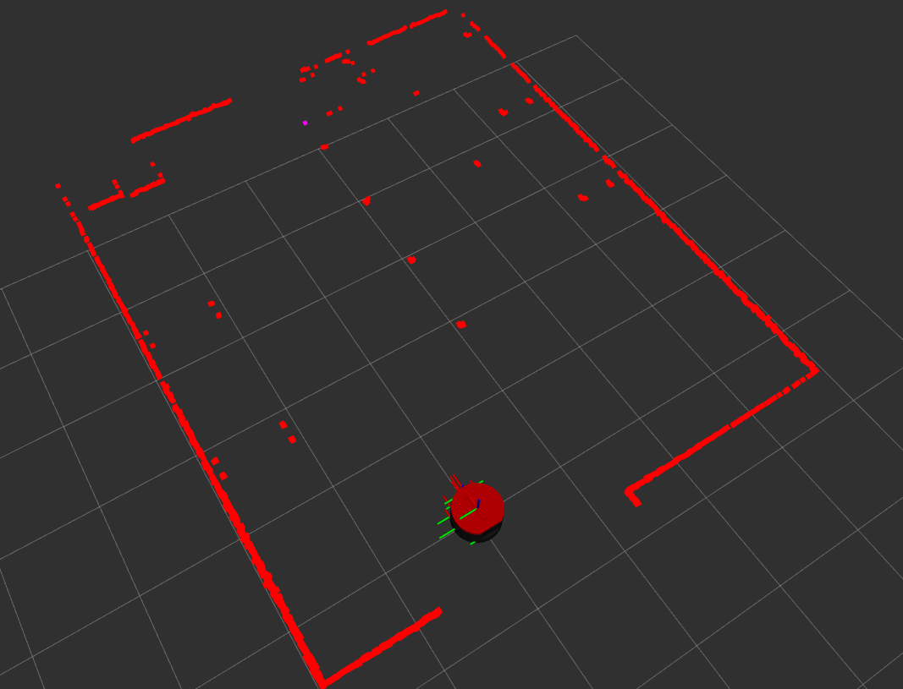
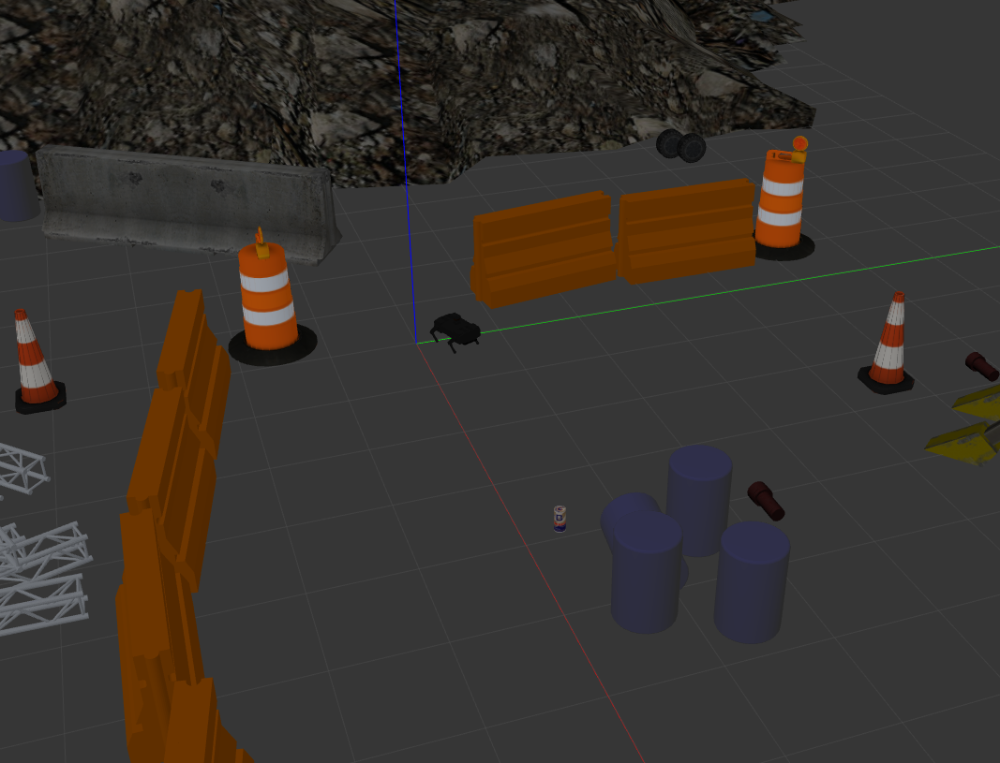
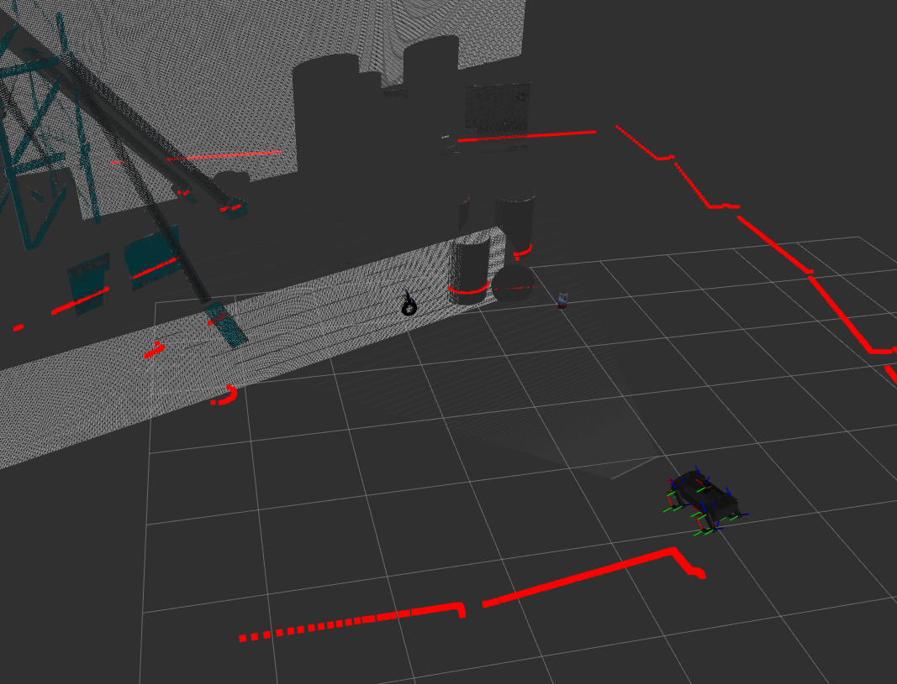

# Robots sim

La simulación de cada robot se realizará en un espacio de trabajo diferente, esto con el fin de evitar conflictos de archivos y no contaminar nuestro estapacio de trabajo principal

## 1. Rb1 robot

La documentación para simular este robot se encuentra en el siguiente enlace [Warehouse Rb1](https://github.com/morg1207/warehouse_rb1_sim/tree/main) o seguir los siguientes pasos.

### 1.1 Simulación

#### 1.1.1 Configuración
```bash
# Descargar repositorio
mkdir -p ~/rb1_ws/src
cd ~/rb1_ws/src
git clone https://github.com/morg1207/warehouse_rb1_sim.git

# Actualizar dependencias
sudo apt update
cd ~/rb1_ws
rosdep init
rosdep update --rosdistro $ROS_DISTRO
sudo apt install ros-humble-teleop-twist-keyboard
rosdep install -i --from-path src --rosdistro $ROS_DISTRO -y

# Compilar
cd ~/rb1_ws
source /opt/ros/humble/setup.bash 
colcon build --symlink-install
```

#### 1.1.2 Lanzar simulacón
Terminal 1 
```bash
cd ~/rb1_ws
source install/setup.bash
ros2 launch the_construct_office_gazebo warehouse_rb1_rviz.launch.xml
```
output gazebo

  

output rviz

  

### 1.1.3 Mover robot

```bash
cd ~/rb1_ws
source install/setup.bash
ros2 run teleop_twist_keyboard  teleop_twist_keyboard
```

## 2. Champ robot

La documentación para simular este robot se encuentra en el siguiente enlace [Champ](https://github.com/chvmp/champ/tree/ros2) pero se recomienda seguir los pasos que se detallan abajo.

### 2.1 Simulación

#### 2.1.1 Configuración

```bash
# Crear espacio de trabajo
mkdir -p ~/champ_ws/src
cd ~/champ_ws/src

# Clonar repositios
git clone --recursive https://github.com/chvmp/champ -b ros2
git clone https://github.com/chvmp/champ_teleop -b ros2

# Instalar dependencias
sudo apt update
sudo apt install -y python3-rosdep

cd ~/champ_ws
rosdep update --rosdistro $ROS_DISTRO
sudo apt install ros-humble-teleop-twist-keyboard -y
rosdep install -i --from-path src --rosdistro $ROS_DISTRO -y

# Añadir archivos rviz
 cd ~/champ_ws
 cp ~/quadruped_robot_ws/src/Quadruped_Project_Scandia/robots_sim/champ_robot/rviz/gazebo.rviz ~/champ_ws/src/champ/

# Solucionar problema de launch
 cd ~/champ_ws
 cp ~/quadruped_robot_ws/src/Quadruped_Project_Scandia/robots_sim/champ_robot/launch/gazebo.launch.py ~/champ_ws/src/champ/champ_gazebo/launch/gazebo.launch.py


# Compilar espacio de trabajo
cd ~/champ_ws
colcon build
source ~/champ_ws/install/setup.bash

```
#### 2.1.2 Lanzar simulación

**Gazebo**

Terminal 1 
```bash
cd ~/champ_ws
source install/setup.bash
ros2 launch champ_config gazebo.launch.py 
```
Output

  

**Rviz2**

Terminal 2 
```bash
cd ~/champ_ws
source install/setup.bash
ros2 run rviz2 rviz2 -d ~/champ_ws/src/champ/gazebo.rviz
```

Output

  

### 2.1.3 Mover robot

```bash
cd ~/champ_ws
source install/setup.bash
ros2 run teleop_twist_keyboard teleop_twist_keyboard
```