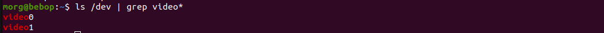

# Test package

## Cámara

1. ###  Configuración de entorno
    ```bash
    source ~/quadruped_robot_ws/install/setup.bash
    ```

2. ### Instalar dependencias

    ```bash
    sudo apt install python3-opencv
    sudo apt update
    sudo apt install v4l-utils
    ```
3. ### Ejecutar publicador
    Terminal 1

    ```bash
    source ~/quadruped_robot_ws/install/setup.bash
    ros2 launch test_package publisher_camera.launch.py device:=0 fps:=10
    ```
    - Parameters:
        - **device**: Dispositivo de video para capturar, para ver la lista de dispositivos ejecutar lo siguiente.
        ```bash
        ls /dev | grep video*
        ```
        output

          

        - **fps**: Frames por segundo, para ver la información de la cámara ejecutar lo siguiente
        ```bash
        v4l2-ctl --device=/dev/video0 --all
        ```
            - Donde 'video0' es el dispositivo analizar.

4. ### Ejecutar suscriptor

    Terminal 2
    ```bash
    source ~/quadruped_robot_ws/install/setup.bash
    ros2 run test_package subscriber_camera 
    ```